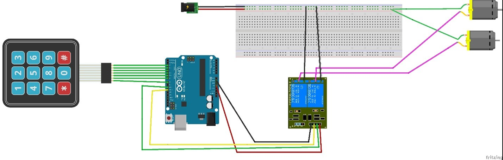
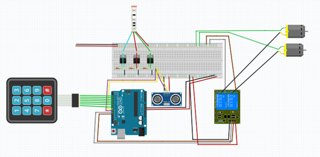

What is Drink Bot?
A machine that dispense drinks
Example
There are two pumps at the moment one for coke and one for whisky. You can call either cola, whisky or both together making a whisky and cola.

Parts used
Uno clone 
bred board medium
3x4 Keypad
2x peristaltic Pumps
4 OD and 2 ID food grade tubing
8 channel relays  
Ultrasonic sensor 
12-volt wall wart
Female DC jack 
3x 330 oms resisters
3 MOSFITS
RGB LED strip
Dupont wires

Wood (measurements using 0.5 in thick board)
2x 12 x 8 in
3x 14 x 7 in
2x 5 x 4 in
1x 7 x 4 in
1x 8 x 5 in
Wood glue and finishing nails

Simple version

   
Version with ultrasonic sensor and LED

(Not the exact wiring I used on the current version but very close)

Box design
 

