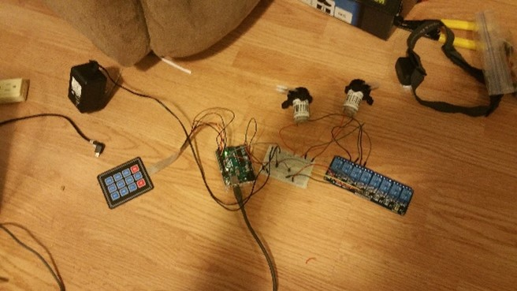

What is Drink Bot?
A machine that dispense drinks
Example
There are two pumps at the moment one for coke and one for whisky. You can call either cola, whisky or both together making a whisky and cola.

Parts used
Uno clone   
bred board medium   
3x4 Keypad   
2x peristaltic Pumps   
4 OD and 2 ID food grade tubing   
8 channel relays   
Ultrasonic sensor   
12-volt wall wart   
Female DC jack   
3x 330 oms resisters   
3 MOSFITS   
RGB LED strip   
Dupont wires   

Wood (measurements using 0.5 in thick board)
2x 12 x 8 in
3x 14 x 7 in
2x 5 x 4 in
1x 7 x 4 in
1x 8 x 5 in
Wood glue and finishing nails

Simple version
 

Version with ultrasonic sensor and LEDS

(Not the exact wiring I used on the current version but very close)

Box design

